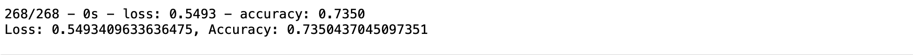
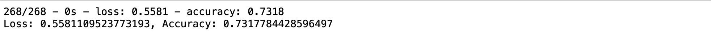

# Neural_Network_Charity_Analysis

## Resources
* Python 3.9.0, 
* Anaconda Navigator 1.9.12,
* Jupyter notebook 6.0.3,
* Pandas, Keras, tenserflow

## Overview

AlphabetSoup is a philatropic organization focused on helping non profit organizations, this project uses a neural network to help alphabetsoup make desicions about funds allocation based on historic data that the organization gathered from previous donations.

## Results

### Data Preprocessing

* the model has as a target if a given company is successful, or the "IS_SUCCESSFUL" column.
* We removed the "EIN" and "NAME" columns as they did not offer any relevant information for our analysis.
* the rest of the columns we used as features.

### Compiling, Training, and Evaluating the Model

* for the first attempt at this the model, we considered 8 neurons in the first layer and 5 in the second, they both had a 'relu' activation function, since relu does a jood job with non linear data, and the output layer had a sigmoid activation function since the outcome is binary in this case (successful or not successfull)
* unfortunately we werent able to get the model to reach 75% accuracy.
* the following pictures represent different results for several attempts to optimize the model.
 
 - first we tried to remove a variable -"SPECIAL_CONSIDERATIONS"- that er thought could be confusing the model 
  
  
  - the second try we added additional layers and also added extra neurons for each layer 
  
  
  - in the next try, we increased the amount of epochs we allowed the model to train, hoping that would give it more time to learn and adabte to the data
  
  
  - we changed activation functions and tried a few different ones, still the model couldnt go over 73% accuracy
  
## summary

After different attempts the model wasnt able to reach 75% accuracy, even after changing the number or neurons, layers, epochs a few times and trying different activation functions. i think the next step is to dig deeper into the dataset and explore it to see if theres any outliers confusing the model.
